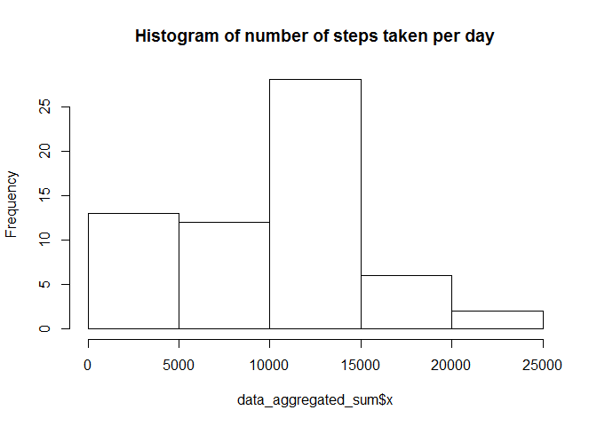
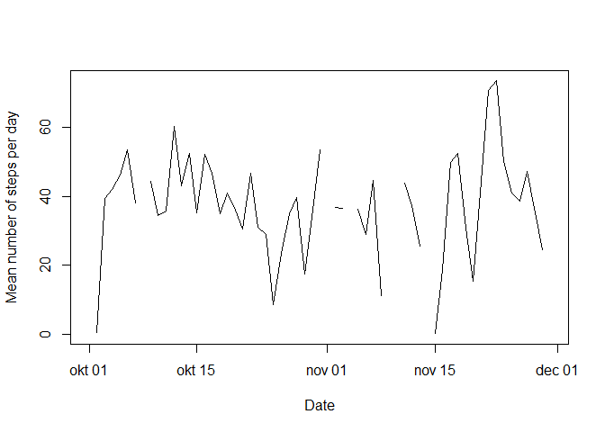
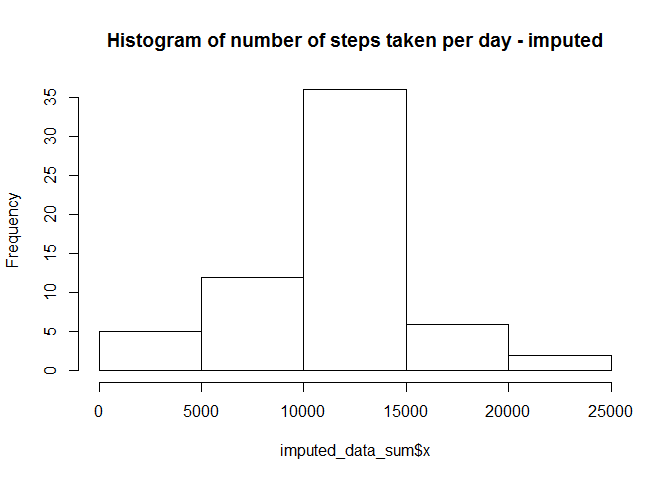
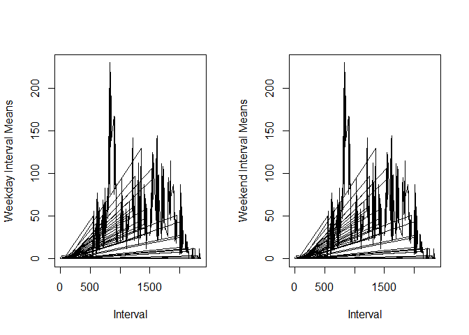

# Reproducible Research Assignment Week 2
Monique van den Broek  
8 juli 2016  


## Loading and preprocessing the data

Unzip and load the data (i.e. read.csv())


```r
setwd("F:/CM-Groep/Cursussen/Data science/05_ReproducibleResearch/Week1/RepData_PeerAssessment1")
unzip("activity.zip")
data <- read.csv("activity.csv", colClasses = "character", na.strings="Not Available")
```

Process/transform the data (if necessary) into a format suitable for your analysis


```r
data$steps <- as.numeric(data$steps)
```

```
## Warning: NAs introduced by coercion
```

## Histogram of the total number of steps taken each day

Histogram of the total number of steps taken each day (ignoring the missing values in the dataset)


```r
data_aggregated_sum <- aggregate(data$steps, list(data$date), sum , na.rm=TRUE)
hist(data_aggregated_sum$x, main="Histogram of number of steps taken per day")
```

<!-- -->

## Mean and median number of steps taken each day

What is mean and median of total number of steps taken per day? (ignoring the missing values in the dataset)
The mean is the 4th element in the data below, the median is the 3rd element in the data below.


```r
data_aggregated_summary <- aggregate(data$steps, list(data$date), summary , na.rm=TRUE)
data_aggregated_summary
```

```
##       Group.1                                                x
## 1  2012-10-01                     NA, NA, NA, NaN, NA, NA, 288
## 2  2012-10-02 0.0000, 0.0000, 0.0000, 0.4375, 0.0000, 117.0000
## 3  2012-10-03           0.00, 0.00, 0.00, 39.42, 15.00, 613.00
## 4  2012-10-04           0.00, 0.00, 0.00, 42.07, 30.25, 547.00
## 5  2012-10-05           0.00, 0.00, 0.00, 46.16, 15.25, 555.00
## 6  2012-10-06           0.00, 0.00, 0.00, 53.54, 35.25, 526.00
## 7  2012-10-07           0.00, 0.00, 0.00, 38.25, 34.00, 523.00
## 8  2012-10-08                     NA, NA, NA, NaN, NA, NA, 288
## 9  2012-10-09           0.00, 0.00, 0.00, 44.48, 20.00, 748.00
## 10 2012-10-10           0.00, 0.00, 0.00, 34.38, 32.25, 413.00
## 11 2012-10-11            0.00, 0.00, 0.00, 35.78, 7.25, 748.00
## 12 2012-10-12           0.00, 0.00, 0.00, 60.35, 32.00, 802.00
## 13 2012-10-13           0.00, 0.00, 0.00, 43.15, 24.25, 542.00
## 14 2012-10-14           0.00, 0.00, 0.00, 52.42, 22.25, 540.00
## 15 2012-10-15                  0.0, 0.0, 0.0, 35.2, 7.0, 786.0
## 16 2012-10-16           0.00, 0.00, 0.00, 52.38, 26.00, 758.00
## 17 2012-10-17           0.00, 0.00, 0.00, 46.71, 11.25, 744.00
## 18 2012-10-18            0.00, 0.00, 0.00, 34.92, 0.00, 759.00
## 19 2012-10-19           0.00, 0.00, 0.00, 41.07, 20.25, 512.00
## 20 2012-10-20           0.00, 0.00, 0.00, 36.09, 13.00, 532.00
## 21 2012-10-21           0.00, 0.00, 0.00, 30.63, 17.25, 501.00
## 22 2012-10-22           0.00, 0.00, 0.00, 46.74, 18.25, 783.00
## 23 2012-10-23           0.00, 0.00, 0.00, 30.97, 12.25, 499.00
## 24 2012-10-24           0.00, 0.00, 0.00, 29.01, 14.25, 533.00
## 25 2012-10-25       0.000, 0.000, 0.000, 8.653, 0.000, 443.000
## 26 2012-10-26           0.00, 0.00, 0.00, 23.53, 15.00, 440.00
## 27 2012-10-27            0.00, 0.00, 0.00, 35.14, 6.00, 555.00
## 28 2012-10-28           0.00, 0.00, 0.00, 39.78, 38.25, 533.00
## 29 2012-10-29            0.00, 0.00, 0.00, 17.42, 0.00, 591.00
## 30 2012-10-30           0.00, 0.00, 0.00, 34.09, 22.00, 523.00
## 31 2012-10-31           0.00, 0.00, 0.00, 53.52, 22.25, 757.00
## 32 2012-11-01                     NA, NA, NA, NaN, NA, NA, 288
## 33 2012-11-02            0.00, 0.00, 0.00, 36.81, 8.25, 753.00
## 34 2012-11-03                 0.0, 0.0, 0.0, 36.7, 25.5, 533.0
## 35 2012-11-04                     NA, NA, NA, NaN, NA, NA, 288
## 36 2012-11-05            0.00, 0.00, 0.00, 36.25, 7.00, 785.00
## 37 2012-11-06           0.00, 0.00, 0.00, 28.94, 11.25, 630.00
## 38 2012-11-07           0.00, 0.00, 0.00, 44.73, 20.50, 766.00
## 39 2012-11-08            0.00, 0.00, 0.00, 11.18, 0.00, 359.00
## 40 2012-11-09                     NA, NA, NA, NaN, NA, NA, 288
## 41 2012-11-10                     NA, NA, NA, NaN, NA, NA, 288
## 42 2012-11-11           0.00, 0.00, 0.00, 43.78, 26.00, 540.00
## 43 2012-11-12            0.00, 0.00, 0.00, 37.38, 0.00, 542.00
## 44 2012-11-13           0.00, 0.00, 0.00, 25.47, 13.50, 444.00
## 45 2012-11-14                     NA, NA, NA, NaN, NA, NA, 288
## 46 2012-11-15  0.0000, 0.0000, 0.0000, 0.1424, 0.0000, 33.0000
## 47 2012-11-16            0.00, 0.00, 0.00, 18.89, 0.00, 475.00
## 48 2012-11-17           0.00, 0.00, 0.00, 49.79, 10.25, 753.00
## 49 2012-11-18           0.00, 0.00, 0.00, 52.47, 29.25, 785.00
## 50 2012-11-19                  0.0, 0.0, 0.0, 30.7, 6.0, 789.0
## 51 2012-11-20            0.00, 0.00, 0.00, 15.53, 0.00, 500.00
## 52 2012-11-21                  0.0, 0.0, 0.0, 44.4, 0.0, 758.0
## 53 2012-11-22           0.00, 0.00, 0.00, 70.93, 42.25, 567.00
## 54 2012-11-23           0.00, 0.00, 0.00, 73.59, 21.25, 760.00
## 55 2012-11-24           0.00, 0.00, 0.00, 50.27, 16.25, 785.00
## 56 2012-11-25           0.00, 0.00, 0.00, 41.09, 20.50, 551.00
## 57 2012-11-26           0.00, 0.00, 0.00, 38.76, 18.25, 709.00
## 58 2012-11-27           0.00, 0.00, 0.00, 47.38, 17.50, 806.00
## 59 2012-11-28            0.00, 0.00, 0.00, 35.36, 0.00, 733.00
## 60 2012-11-29            0.00, 0.00, 0.00, 24.47, 0.00, 568.00
## 61 2012-11-30                     NA, NA, NA, NaN, NA, NA, 288
```

## Time series plot of the average number of steps taken


```r
data_aggregated_mean <- aggregate(data$steps, list(data$date), mean , na.rm=TRUE)
plot(as.Date(data_aggregated_mean$Group.1), data_aggregated_mean$x, type = "l", xlab= "Date", ylab= "Mean number of steps per day")
```

<!-- -->

## The 5-minute interval that, on average, contains the maximum number of steps


```r
data$date[[which.max(data$steps)]]
```

```
## [1] "2012-11-27"
```

```r
data$interval[[which.max(data$steps)]]
```

```
## [1] "615"
```

## Code to describe and show a strategy for imputing missing data

The missing values are replace by the average value for that specific interval

```r
tapply(is.na(data$steps), data$date, FUN=sum)
```

```
## 2012-10-01 2012-10-02 2012-10-03 2012-10-04 2012-10-05 2012-10-06 
##        288          0          0          0          0          0 
## 2012-10-07 2012-10-08 2012-10-09 2012-10-10 2012-10-11 2012-10-12 
##          0        288          0          0          0          0 
## 2012-10-13 2012-10-14 2012-10-15 2012-10-16 2012-10-17 2012-10-18 
##          0          0          0          0          0          0 
## 2012-10-19 2012-10-20 2012-10-21 2012-10-22 2012-10-23 2012-10-24 
##          0          0          0          0          0          0 
## 2012-10-25 2012-10-26 2012-10-27 2012-10-28 2012-10-29 2012-10-30 
##          0          0          0          0          0          0 
## 2012-10-31 2012-11-01 2012-11-02 2012-11-03 2012-11-04 2012-11-05 
##          0        288          0          0        288          0 
## 2012-11-06 2012-11-07 2012-11-08 2012-11-09 2012-11-10 2012-11-11 
##          0          0          0        288        288          0 
## 2012-11-12 2012-11-13 2012-11-14 2012-11-15 2012-11-16 2012-11-17 
##          0          0        288          0          0          0 
## 2012-11-18 2012-11-19 2012-11-20 2012-11-21 2012-11-22 2012-11-23 
##          0          0          0          0          0          0 
## 2012-11-24 2012-11-25 2012-11-26 2012-11-27 2012-11-28 2012-11-29 
##          0          0          0          0          0          0 
## 2012-11-30 
##        288
```

```r
# Fill with mean for that interval
data_aggregated_interval <- aggregate(data$steps, list(data$interval), mean , na.rm=TRUE)
data_aggregated_interval$interval <- data_aggregated_interval$Group.1
imputed_data <- merge(data, data_aggregated_interval, by = "interval")
for(i in 1:nrow(imputed_data)) if(is.na(imputed_data[i,]$steps)) imputed_data[i,]$steps <- imputed_data[i,]$x
```

## Histogram of the total number of steps taken each day after missing values are imputed

Calculate the total number of steps per day and the mean and median

```r
imputed_data_sum <- aggregate(imputed_data$steps, list(imputed_data$date), sum , na.rm=TRUE)
hist(imputed_data_sum$x, main="Histogram of number of steps taken per day - imputed")
```

<!-- -->

```r
imputed_data_summary <- aggregate(imputed_data$steps, list(imputed_data$date), summary , na.rm=TRUE)
imputed_data_summary
```

```
##       Group.1   x.Min. x.1st Qu. x.Median   x.Mean x.3rd Qu.   x.Max.
## 1  2012-10-01   0.0000    2.4860  34.1100  37.3800   52.8300 206.2000
## 2  2012-10-02   0.0000    0.0000   0.0000   0.4375    0.0000 117.0000
## 3  2012-10-03   0.0000    0.0000   0.0000  39.4200   15.0000 613.0000
## 4  2012-10-04   0.0000    0.0000   0.0000  42.0700   30.2500 547.0000
## 5  2012-10-05   0.0000    0.0000   0.0000  46.1600   15.2500 555.0000
## 6  2012-10-06   0.0000    0.0000   0.0000  53.5400   35.2500 526.0000
## 7  2012-10-07   0.0000    0.0000   0.0000  38.2500   34.0000 523.0000
## 8  2012-10-08   0.0000    2.4860  34.1100  37.3800   52.8300 206.2000
## 9  2012-10-09   0.0000    0.0000   0.0000  44.4800   20.0000 748.0000
## 10 2012-10-10   0.0000    0.0000   0.0000  34.3800   32.2500 413.0000
## 11 2012-10-11   0.0000    0.0000   0.0000  35.7800    7.2500 748.0000
## 12 2012-10-12   0.0000    0.0000   0.0000  60.3500   32.0000 802.0000
## 13 2012-10-13   0.0000    0.0000   0.0000  43.1500   24.2500 542.0000
## 14 2012-10-14   0.0000    0.0000   0.0000  52.4200   22.2500 540.0000
## 15 2012-10-15   0.0000    0.0000   0.0000  35.2000    7.0000 786.0000
## 16 2012-10-16   0.0000    0.0000   0.0000  52.3800   26.0000 758.0000
## 17 2012-10-17   0.0000    0.0000   0.0000  46.7100   11.2500 744.0000
## 18 2012-10-18   0.0000    0.0000   0.0000  34.9200    0.0000 759.0000
## 19 2012-10-19   0.0000    0.0000   0.0000  41.0700   20.2500 512.0000
## 20 2012-10-20   0.0000    0.0000   0.0000  36.0900   13.0000 532.0000
## 21 2012-10-21   0.0000    0.0000   0.0000  30.6300   17.2500 501.0000
## 22 2012-10-22   0.0000    0.0000   0.0000  46.7400   18.2500 783.0000
## 23 2012-10-23   0.0000    0.0000   0.0000  30.9700   12.2500 499.0000
## 24 2012-10-24   0.0000    0.0000   0.0000  29.0100   14.2500 533.0000
## 25 2012-10-25   0.0000    0.0000   0.0000   8.6530    0.0000 443.0000
## 26 2012-10-26   0.0000    0.0000   0.0000  23.5300   15.0000 440.0000
## 27 2012-10-27   0.0000    0.0000   0.0000  35.1400    6.0000 555.0000
## 28 2012-10-28   0.0000    0.0000   0.0000  39.7800   38.2500 533.0000
## 29 2012-10-29   0.0000    0.0000   0.0000  17.4200    0.0000 591.0000
## 30 2012-10-30   0.0000    0.0000   0.0000  34.0900   22.0000 523.0000
## 31 2012-10-31   0.0000    0.0000   0.0000  53.5200   22.2500 757.0000
## 32 2012-11-01   0.0000    2.4860  34.1100  37.3800   52.8300 206.2000
## 33 2012-11-02   0.0000    0.0000   0.0000  36.8100    8.2500 753.0000
## 34 2012-11-03   0.0000    0.0000   0.0000  36.7000   25.5000 533.0000
## 35 2012-11-04   0.0000    2.4860  34.1100  37.3800   52.8300 206.2000
## 36 2012-11-05   0.0000    0.0000   0.0000  36.2500    7.0000 785.0000
## 37 2012-11-06   0.0000    0.0000   0.0000  28.9400   11.2500 630.0000
## 38 2012-11-07   0.0000    0.0000   0.0000  44.7300   20.5000 766.0000
## 39 2012-11-08   0.0000    0.0000   0.0000  11.1800    0.0000 359.0000
## 40 2012-11-09   0.0000    2.4860  34.1100  37.3800   52.8300 206.2000
## 41 2012-11-10   0.0000    2.4860  34.1100  37.3800   52.8300 206.2000
## 42 2012-11-11   0.0000    0.0000   0.0000  43.7800   26.0000 540.0000
## 43 2012-11-12   0.0000    0.0000   0.0000  37.3800    0.0000 542.0000
## 44 2012-11-13   0.0000    0.0000   0.0000  25.4700   13.5000 444.0000
## 45 2012-11-14   0.0000    2.4860  34.1100  37.3800   52.8300 206.2000
## 46 2012-11-15   0.0000    0.0000   0.0000   0.1424    0.0000  33.0000
## 47 2012-11-16   0.0000    0.0000   0.0000  18.8900    0.0000 475.0000
## 48 2012-11-17   0.0000    0.0000   0.0000  49.7900   10.2500 753.0000
## 49 2012-11-18   0.0000    0.0000   0.0000  52.4700   29.2500 785.0000
## 50 2012-11-19   0.0000    0.0000   0.0000  30.7000    6.0000 789.0000
## 51 2012-11-20   0.0000    0.0000   0.0000  15.5300    0.0000 500.0000
## 52 2012-11-21   0.0000    0.0000   0.0000  44.4000    0.0000 758.0000
## 53 2012-11-22   0.0000    0.0000   0.0000  70.9300   42.2500 567.0000
## 54 2012-11-23   0.0000    0.0000   0.0000  73.5900   21.2500 760.0000
## 55 2012-11-24   0.0000    0.0000   0.0000  50.2700   16.2500 785.0000
## 56 2012-11-25   0.0000    0.0000   0.0000  41.0900   20.5000 551.0000
## 57 2012-11-26   0.0000    0.0000   0.0000  38.7600   18.2500 709.0000
## 58 2012-11-27   0.0000    0.0000   0.0000  47.3800   17.5000 806.0000
## 59 2012-11-28   0.0000    0.0000   0.0000  35.3600    0.0000 733.0000
## 60 2012-11-29   0.0000    0.0000   0.0000  24.4700    0.0000 568.0000
## 61 2012-11-30   0.0000    2.4860  34.1100  37.3800   52.8300 206.2000
```

The results look different. We have used the average per interval to fill the gaps, this results in more weight in the middle of the histogram. Also de medians for the days we have filled the gaps are higher than for the other days, as we assume that every hour there will be activity. Maybe it would have been better to use the median instead of the mean for filling the gaps.

## Panel plot comparing the average number of steps taken per 5-minute interval across weekdays and weekends

First calculate for each date if it is week or weekend. Then take the average number of steps per interval for week/weekend and plot these results.


```r
library(chron)
```

```
## Warning: package 'chron' was built under R version 3.2.5
```

```r
imputed_data$dow <- weekdays(as.Date(imputed_data$date),abbr = TRUE)
imputed_data$weekend = chron::is.weekend(imputed_data$date)

imputed_data_weekend <- aggregate(imputed_data$steps, list(imputed_data$weekend, imputed_data$interval), mean , na.rm=TRUE)
par(mfrow = c(1,2))
with(imputed_data_weekend[imputed_data_weekend$Group.1 == FALSE,], plot(imputed_data_weekend$Group.2, imputed_data_weekend$x, type = "l", ylab = 'Weekday Interval Means',xlab = 'Interval'))
with(imputed_data_weekend[imputed_data_weekend$Group.1 == TRUE,],  plot(imputed_data_weekend$Group.2, imputed_data_weekend$x, type = "l", ylab = 'Weekend Interval Means',xlab = 'Interval'))
```

<!-- -->

